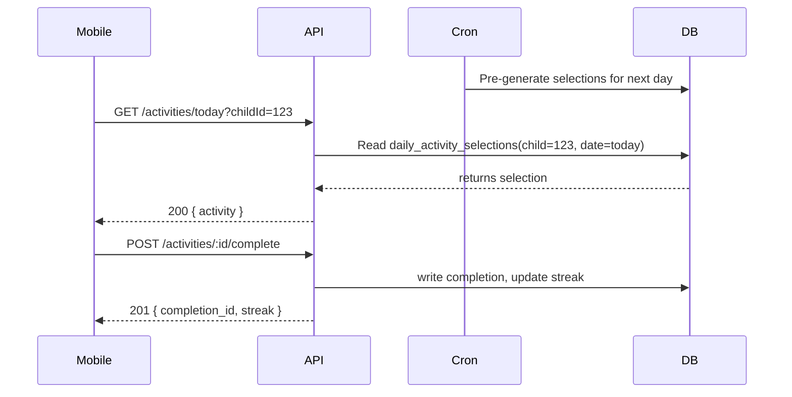

# ChampionKids — High Level Product Spec (Claude folder)

## Overview
ChampionKids helps parents deliver brief, research-backed coaching activities to children aged 1–12. The product includes a mobile app (React Native), a parent web portal, and an internal admin dashboard. Server-side services (FastAPI) power daily activity selection, subscription management, and analytics.

## Goals
- Enable parents to run a 5-minute activity daily with minimal friction.
- Provide measurable progress across 7 skill categories.
- Offer a clear upgrade path from free trial to paid family plans.
- Scale to support personalized selection (ML) and multi-child households.

## Key Users
- Parent (primary): mobile-first, manages child profiles, completes activities.
- Child (beneficiary): no direct login; data is managed via parent account.
- Admin: internal content and user management dashboard.

## Core Features (High Level)
- Onboarding flow that creates account + first child + trial activation.
- Daily Activity Engine: pre-generates one activity per child per day (rule-based P1, ML in P3).
- Activity Library: browse, filter, search activities; paywall for library starts (today card accessible).
- Child profile management with plan-based limits (1 vs. up to 4 children).
- Subscriptions & entitlements backed by Stripe and Supabase (or Supabase-managed auth + Supabase webhooks).
- Progress tracking: completions, streaks, badges (P2 for badges/advanced analytics).

## System Architecture (Top Level)
- Mobile: React Native app (championkids-mobile) using Supabase client for auth and API client to FastAPI.
- Web: React/Next (championkids-web) for parent portal and marketing.
- API: FastAPI (championkids-api) serving REST endpoints for activities, selections, completions, subscriptions.
- Database: MongoDB (or Postgres) for core data; Redis for caching/selection state; background workers (Celery/RQ) for cron pre-generation.
- Payments: Stripe for checkout; entitlement resolution layer reconciles Stripe webhook events to application-level subscriptions.
- Admin: Separate Next.js admin app with RBAC and internal auth.

## Data Model (Summary)
- users: parent accounts (email, name, auth provider refs)
- children: display_name, date_of_birth, avatar_id, skill_focuses
- activities: id, title, skill_category, age_band_tags, content, status (draft/published/archived)
- daily_activity_selections: child_id, date, activity_id, generated_by (cron/manual), was_shown
- activity_completions: child_id, activity_id, parent_id, timestamp, reaction
- subscriptions: user_id, plan_type, status, trial_ends_at, stripe_customer_id

## APIs (Representative)
- POST /auth/signup, POST /auth/login
- GET /activities/today?childId={id}
- GET /activities?filters...
- POST /activities/:id/complete
- POST /children, GET /children/:id
- POST /subscriptions/checkout (server creates Stripe session)
- Webhooks: /webhooks/stripe (entitlement sync)

## Auth & Permissions
- Parents: Supabase Auth (email/password, Google, Apple). Token-based access to API.
- Admin: Separate RBAC with staff roles; admin sessions are not the same as parent sessions.
- Children: never authenticate directly; all child actions are authored by parent.

## Deployment & Infra
- Containerized services (Docker) orchestrated via Kubernetes or managed services.
- CI: run unit tests, static checks, build images, deploy to staging and production.
- Cron job (nightly) to pre-generate daily selections; background workers for heavy tasks.
- Observability: Prometheus + Grafana for metrics; Sentry for errors; structured event logging for analytics.

## Security & Privacy
- COPPA/child-data: ensure children never sign-in and limit PII (no photo uploads). DOB is stored but age band derived at runtime.
- GDPR: ability to export and delete account data; soft-delete retention rules.
- Secrets: store Stripe keys, DB creds in a secrets manager (Vault/Cloud KMS).

## Phasing / Roadmap (High Level)
- Phase 1 (MVP, Weeks 1–12): Mobile app with onboarding, daily engine (rule-based), activity library, subscription flow, admin content publishing.
- Phase 2 (Growth, Weeks 13–20): Multi-child support (Family Plan), enhanced progress visuals, saved activities, improved onboarding retention hooks.
- Phase 3 (Scale, Weeks 21–32): ML personalization, content experiment framework (A/B), richer analytics, internationalization.

## Measurement & Success Criteria (Top-level)
- Day-7 retention ≥ 40% (MVP target)
- Activity completion rate ≥ 60%
- Trial-to-paid conversion ≥ 15% within 7 days
- Pre-generation success rate 99.9% (cron job reliability)

## Open Questions / Decisions
- Primary DB: MongoDB vs. Postgres (schema flexibility vs. relational queries for analytics)
- Entitlement reconciliation: in-process webhooks vs. separate reconciliation job
- Analytics back-end: custom event logs vs. third-party (Amplitude / PostHog)

---

Created file: [Claude-ai/CLAUDE_HIGH_LEVEL_SPEC.md](Claude-ai/CLAUDE_HIGH_LEVEL_SPEC.md)

## API Schemas (Representative)

1) GET /activities/today?childId={id}
- Response 200 OK
	{
		"child_id": "string",
		"date": "2026-03-27",
		"activity": {
			"id": "string",
			"title": "The 'What If' Game",
			"age_band": "7-8",
			"skill_category": "Critical Thinking",
			"time_estimate": "~5 min",
			"coaching_prompt": "...",
			"follow_up_questions": ["..."],
			"variation": "..."
		}
	}

2) POST /activities/:id/complete
- Request
	{ "child_id": "string", "parent_id": "string", "reaction": "😊" }
- Response 201 Created
	{ "completion_id": "string", "timestamp": "2026-03-27T10:00:00Z", "streak": 3 }

3) POST /children
- Request
	{ "display_name": "Maya", "date_of_birth": "2018-06-01", "avatar_id": "a3", "skill_focuses": ["Communication"] }
- Response 201 Created
	{ "child_id": "string", "age_band": "3-4" }

4) POST /subscriptions/checkout
- Request
	{ "user_id": "string", "plan": "family_monthly" }
- Response 200
	{ "checkout_url": "https://checkout.stripe.com/..." }

5) POST /webhooks/stripe
- Payload: Stripe event (forwarded). Server reconciles to update `subscriptions` and `entitlements`.

6) GET /activities?query=&page_cursor=
- Response includes cursor-based pagination and filter metadata.

Notes: include OpenAPI-compatible schemas later (YAML/JSON). These representative examples are sufficient for initial backend implementation and client mocks.

## Sequence Diagram — Daily Activity Flow

## Acceptance Tests (Selected, high-level)

- Onboarding: completing 4-step onboarding creates user, child, and trial subscription (trial_ends_at = now + 7 days).
- Daily Engine: every active child has one `daily_activity_selections` per calendar day; deduplication window of 30 days enforced.
- Activity Completion: POST /activities/:id/complete creates a completion record, increments streak only once per parent per day.
- Library Access: free users see activity metadata but cannot start library activity (Paywall response); today's card accessible regardless of tier.
- Subscriptions: Stripe webhook events update `subscriptions` and `entitlements` reliably; entitlement reconciliation job can correct missed webhooks.

Each acceptance test should include setup, API calls, expected DB state, and teardown steps; these can be converted to pytest + testclient tests for `championkids-api`.

## Next Steps

- Generate OpenAPI spec (YAML) from these schemas.
- Add sample pytest/HTTP tests under `championkids-api/tests` for onboarding and daily engine.
- Expand sequence diagrams for edge cases (archived activity fallback, birthday age-band transition).

Next: I'll mark the expansion steps completed and prepare the finalization step.